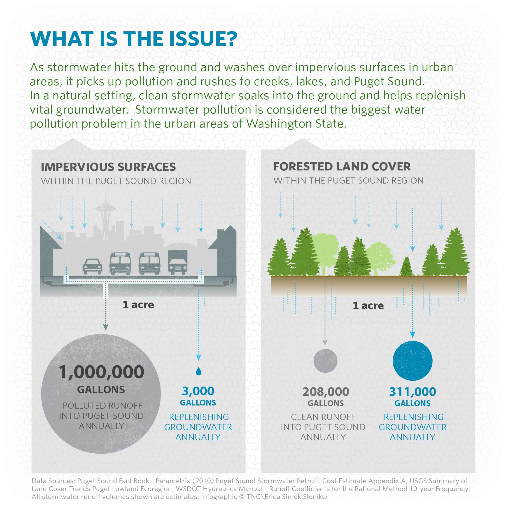

## 583 square miles!

That's how much impervious surface there is in the Puget Sound region, according to
land cover data developed for the Puget Sound Stormwater Heatmap. These images show
the remarkable detail that our team was able to capture in the Stormwater Heatmap.

<!--  -->
<figcaption align = "center">The Puget Sound Region</figcaption>

<figcaption align = "center">Seattle, Kirkland, and the Eastside</figcaption>

<figcaption align = "center">Seattle's Laurelhurst Neighborhood</figcaption>

## Why accurately measuring imperviousness is  important
When rainwater encounters impervious surfaces, it is unable to soak into the ground, as it would in undeveloped landscapes. Instead, it accumulates and rapidly flows over these impermeable surfaces, making its way into nearby drainage systems, streams, and rivers. The net effect is an augmented volume of stormwater runoff that is discharged into the surrounding environment, carrying with it various pollutants and contaminants.

The surge in stormwater runoff poses a range of challenges for local waterways. First and foremost, the increased volume and intensity of runoff can lead to higher streamflow rates, exacerbating the risk of erosion and sedimentation. These changes can detrimentally impact the physical habitat structure within aquatic ecosystems, altering channel morphology, and potentially reducing suitable habitat for aquatic organisms.

> **There is enough impervious surface in Puget Sound to pave a four-lane highway circling the globe two and a half times!**

The increased runoff from impervious surfaces also carries a cocktail of pollutants, including sediments, heavy metals, oils, pesticides, and nutrients. As the runoff transports these contaminants to local rivers and streams, it can degrade water quality, leading to water quality impacts like salmon mortality.

Mapping the spatial extent of imperviousness helps us understand  the distribution of stormwater-related challenges. This data is being used to better understand urban impacts to Puget Sound and to inform strategies to improve water quality and clean up our runoff.

## Explore imperviousness in your neighborhood

View the imperviousness layer on the Stormwater Heatmap
[link to map]

Find out how this layer was developed
[link to methods]

