# Water Quality Statistics

We developed a series of linear mixed effects models to estimate
concentrations for constituents of concern (COCs) in Puget Sound urban
stormwater. Spatial covariates in the models included various landscape
predictors, rainfall, seasonal components, and in some models, percent land use (commercial,
industrial, residential).

## Data Sources

### Outfall Data

The primary source of measured stormwater data is the S8.D Municipal
Stormwater Permit Outfall Data (referred to as the S8 Data in this
document) provided by the Washington Department of Ecology (Hobbs et al., 2015). Special Condition S8.D of the 2007-2012 Phase I
Municipal Stormwater Permit required permittees to collect and analyze
data to evaluate pollutant loads in stormwater discharged from different
land uses: high density (HD) residential, low density (LD) residential,
commercial, and industrial. Phase I Permittees\[1\] collected water
quality and flow data, sediment data, and toxicity information from
stormwater discharges during storm events. Stormwater data collected
from a total of 16 outfalls by six Phase I Permittees was utilized in
this modeling study.

The stormwater outfall data is available from Ecology via an open-data
api at:
[https://data.wa.gov/Natural-Resources-Environment/Municipal-Stormwater-
Permit-Outfall-Data/d958-q2ci.](https://data.wa.gov/Natural-Resources-Environment/Municipal-Stormwater-%20Permit-Outfall-Data/d958-q2ci.%20)

COCs analyzed in this study are:

- Copper – Total

- Total Suspended Solids (TSS)

- Phosphorus – Total

- Total Kjeldahl Nitrogen (TKN)

- Zinc – Total 

We extracted data for these COCs, and performed minimal data cleaning.
We filtered out rejected data (values with a R or REJ flag), removed
replicates, and removed one data point for TKN that was an outlier
(an order of magnitude higher than the majority of the
data). Figure 4.1 shows data before removal of the outlier.

**Figure 4.1** All observations with outlier in place for Total Kjeldahl nitrogen (TKN)

### Censored (Non-Detect) Data

Nearly all COCs had non-detect (left-censored) data present (Table 4.1).
Ecology flagged non-detect data and provided the reporting limit for
each non-detect value. Most COCs had a very small percentage of data that
were non-detect (2% or less); one COC, TKN, had a higher level of non-detect 
data (just over 10%). For all COCs, non-detect values were substituted with
one-half of the reporting limit. Models using censored methods were compared to 
linear models for TKN to verify that data substitution on linear mixed effects
models generated suitable results. 

**Table 4.1** Percentage of data points that were left-censored (non-detect)
for each chemical of concern

| Chemical of Concern    | Censored Data Percentage | Notes                                                                                                                                                                                                                                           |
|------------------------|--------------------------|-------------------------------------------------------------------------------------------------------------------------------------------------------------------------------------------------------------------------------------------------|
| Total Copper           | 0%                       | 4 samples were field blanks misclassified as ND’s. Censored data percentage was calculated following removal of these 4 field blanks.                                                                                                           |
| Total Kjeldahl Nitrogen| 9.76%                    |                                                                                                                                                                                                                                                 |
| Total Phosphorus       | 1.17%                    | 3 samples with high results were classified as ND’s, but should have been flagged as “estimated”. Censored data percentage was calculated following reclassification of these 3 data points.                                                    |
| Total Suspended Solids | 0.83%                    |                                                                                                                                                                                                                                                 |
| Total Zinc             | 0%                       | 4 samples were field blanks misclassified as ND’s. Censored data percentage was calculated following removal of these 4 field blanks|                                                                                                       |

### Transformation of outfall data

Each COC was then evaluated for its underlying distribution, to
determine whether transformation would be beneficial prior to running a
linear mixed effects model on the results. Quantile-quantile plots (QQ
plots) using a normal distribution, gamma distribution, square-root
transformed distribution, and log-transformed distribution were visually
analyzed. For all COC’s, log-transformation was deemed an appropriate
data transformation prior to model analysis (Fig. 4.2).

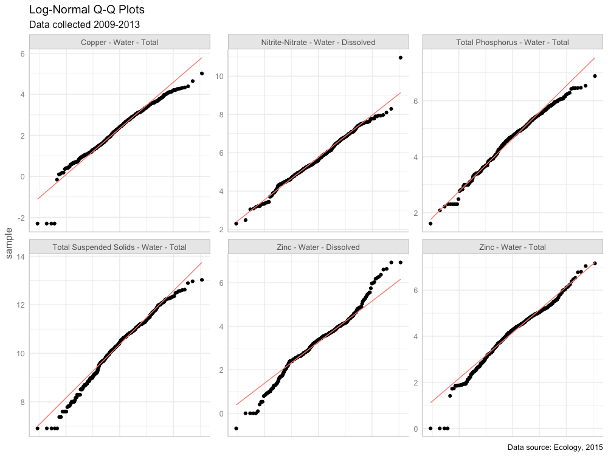

**Figure 4.2** Quantile-quantile plots of COCs using a natural-log (ln) scale.
Red line shows the QQ-line.

## Spatial Data

For this study, we did not rely on the permittee’s self-reported land
use type to run regression models predicting pollution loading from land
use. A visual scan of our land cover data layer versus self-reported
land use types revealed little agreement among permittee definitions of
the four land use types (high density residential, low density
residential, commercial, industrial). Therefore, we compiled a suite of
continuous datasets from which to run chemical loading models. We divide
these into land use and landscape data.

### Land Use

In order to employ a consistent analysis across different monitored
watersheds we extracted land use data from the Washington Department of
Commerce Land Use: Puget Sound Mapping Project (<a href="<<https://www.commerce.wa.gov/serving-communities/growth-management/puget-sound-mapping-project>/" class="uri"><del>https://www.commerce.wa.gov/serving-communities/growth-management/puget-sound-mapping-project</del></a>). Land use classes (also listed in Table
4.2) include:

- Intensive urban (includes commercial areas, apartment buildings)

- Urban residential (includes the majority of urban and suburban
    single-family dwellings)

- Rural residential

- Industrial

In addition, we combined some land use classes to generate additional
land use classes:

- Total residential (urban residential + rural residential)

- Intensive Urban + Industrial; the industrial land use category did
    not have many non-zero data points

### Landscape Data

For each watershed contained in the S8 dataset, potentially relevant
landscape data were extracted from the following sources (Table 4.2):

**Table 4.2**: Sources of landscape spatial predictor data used to develop statistical models.

| **Layer**                             | **ID**            | **Source**                                                                       |
|---------------------------------------|-------------------|----------------------------------------------------------------------------------|
| urban residential                     | urbRES            | Washington State Department of Commerce, Puget Sound Mapping Project             |
| rural residential                     | ruRES             |                                                                                  |
| total residential (urban + rural)     | totRES            |                                                                                  |
| intensive urban                       | intURB            |                                                                                  |
| industrial                            | IND               |                                                                                  |
| intensive urban + industrial          | intURB\_IND       |                                                                                  |
| impervious surfaces                   | impervious        |                                                                                  |
| paved surfaces                        | paved             |                                                                                  |
| rooftop density                       | roofs             |                                                                                  |
| urban residential rooftops            | roof\_urbRES      | rooftop density applied to Washington State Department of Commerce, Puget Sound Mapping Project data |
| total residential rooftops            | roof\_totRES      |                                                                                  |
| intensive urban rooftops              | roof\_intURB      |                                                                                  |
| intensive urban + industrial rooftops | roof\_intURB\_IND |                                                                                  |
| grass & low vegetation                | grass             |                                                                                  |
| tree cover                            | trees             |                                                                                  |
| total vegetative cover                | greenery          |                                                                                  |
| undeveloped areas                     | nodev             |                                                                                  |
| traffic                               | traffic           |                                                                                  |
| population                            | popn              |                                                                                  |
| particulate matter 2.5um              | pm25\_na          |                                                                                  |
| particulate surface area              | partSA            |                                                                                  |
| NO2                                   | no2               |                                                                                  |
| carbon emissions, commercial          | CO2\_com          | Vulcan Carbon Dioxide Emissions data set                                         |
| carbon emissions, residential         | CO2\_res          |                                                                                  |
| carbon emissions, road                | CO2\_road         |                                                                                  |
| carbon emissions, nonroad             | CO2\_nonroad      |                                                                                  |
| carbon emissions, total               | CO2\_tot          |                                                                                  |
| slope                                 | slope             |                                                                                  |
| age of development                    | devAge            | Calculated value based on year of development                                    |

### Pre-processing of spatial data

In order to use the landscape data at an appropriate scale across the
study area, spatial predictors were stacked and then convolved with a
100-meter gaussian kernel. This resulted in "fuzzy" predictors that could apply across dataset boundaries. These values were then extracted for each monitored watershed.

Prior to use, spatial data were plotted and visually assessed for
outliers (Fig. 4.3). Square-root transformation was performed on spatial
data sets with outliers that were higher than the rest of the
predictor’s values: popn, slope, CO2\_res, CO2\_com, CO2\_road,
CO2\_nonroad, CO2\_tot. The devAge spatial predictor had a low data
outlier; devAge values were squared to address the low outlier. Figure
4.4 shows the spatial data following transformation.

Prior to use in models, spatial data sets were scaled and centered using
the mean and standard deviation from the 14 watersheds in this study.

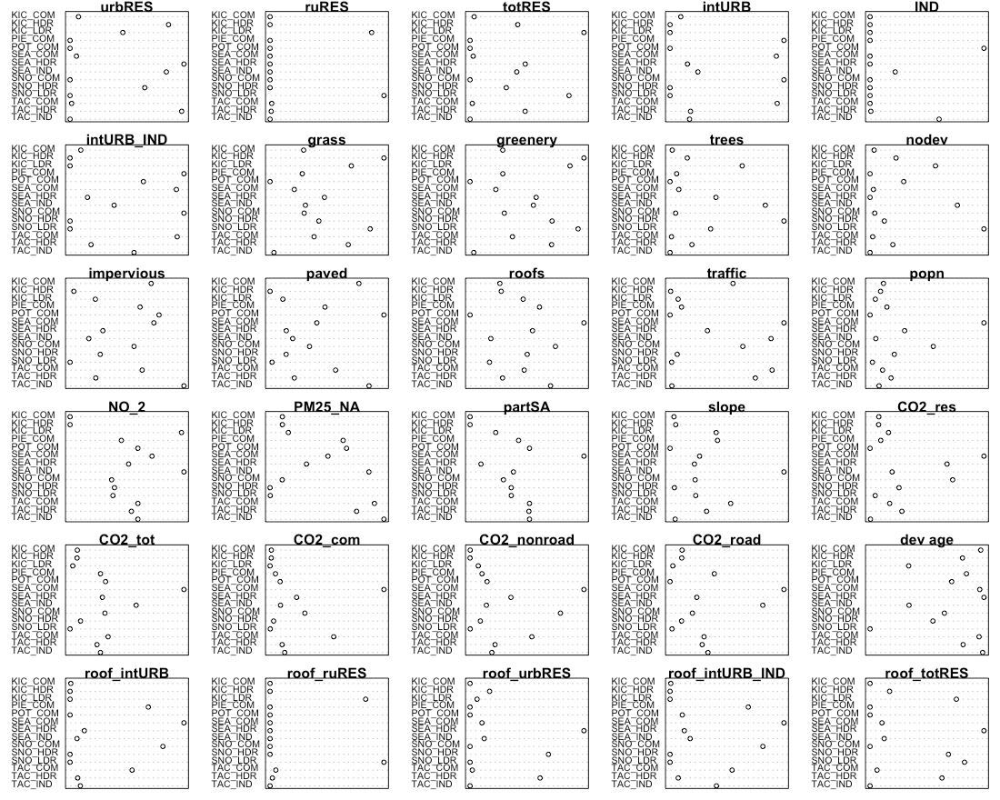

**Figure 4.3** Raw spatial data

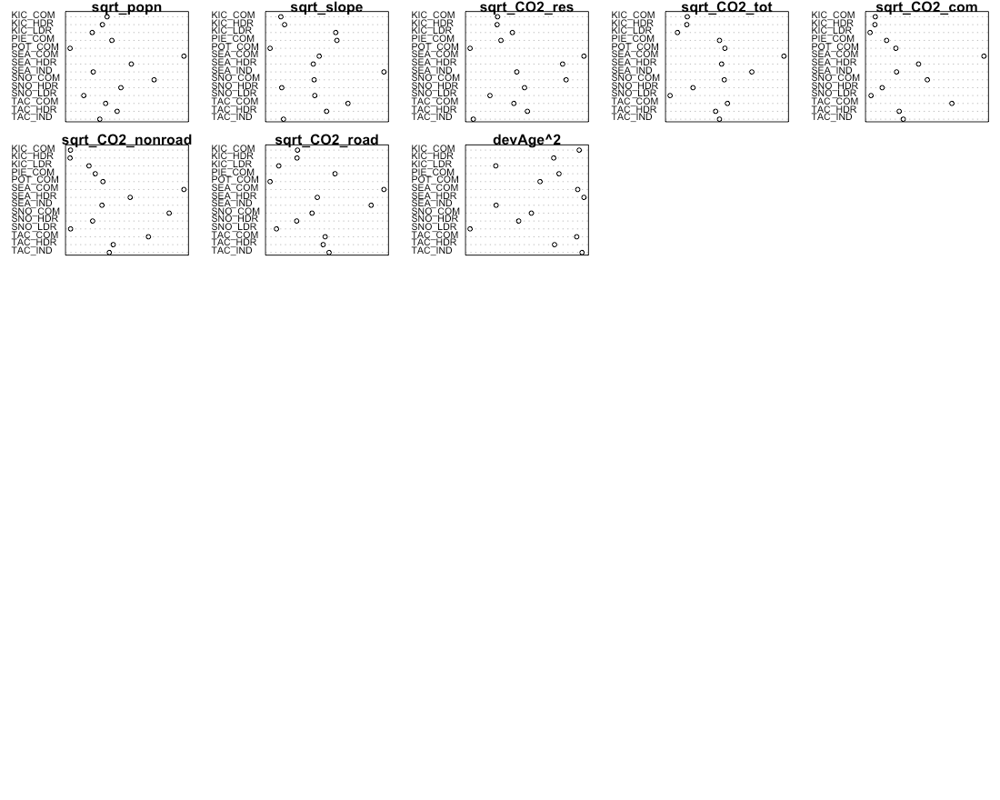

**Figure 4.4** Spatial data following transformation

### Precipitation Data

Daily rainfall data were obtained from the DayMet website operated by
NASA (<https://daymet.ornl.gov/>). Daily data were obtained for years
2009 to 2013, and cumulative one day, three day, and seven day, 14-day,
21-day and 28-day antecedent precipitation were calculated for each
sampling date. For example, for a sampling date of March 22, cumulative
three-day precipitation would include precipitation occurring on March
20, 21 and 22. For each COC, *ln*-transformed chemical concentrations
were plotted against each precipitation measurement, and the plots were
visually assessed to select the most appropriate time scale for
precipitation. Cumulative 21-day precipitation was selected for copper
and phosphorus, while 1-day precipitation was selected for TSS.

## Model Construction and Selection

Selection of the best model for each COC was performed
using the methodology of Zuur al. (2009), as outlined in 
the steps below. Statistical analyses and model fitting
were performed in R (R Core Team, 2021).

### Step 1. Select strong potential landscape predictors

The initial step was to find a suitable set of potential landscape predictors for
the COC in question. Single-predictor linear models were constructed for
the relationship between *ln*-transformed chemical concentration and
each landscape predictor, in turn. Plots were visually
assessed to determine candidate predictors for linear mixed effects
models. We looked for slopes with a p-value of &lt; 0.05, and for data
points to fall roughly along the best fit model line. If prior knowledge
indicated the importance of certain predictors, those were also included
in the set of candidate predictors.

### Step 2. Construct a beyond-optimal model, controlling for collinearity

The starting point of our model selection process was a "beyond-optimal"
model, where the fixed component of the mixed effects model contained
as many strong landscape predictors as possible. To prevent using highly
correlated landscape predictors together in statistical models, we calculated
calculated the correlation coefficient for each coefficient pair of landscape
predictors, and eliminated select predictors to reduce correlation. We then
constructed a generalized leas squared (gls) model in R (nlme package, Pinheiro
et al., 2021) using the beyond-optimal set of fixed effects, and utilizing restricted 
maximum likelihood estimation (REML).

Throughout the model selection process, highly correlated landscape 
predictors (correlation coefficient ≥0.85) were not used together in any models. 

### Step 3. Control for heterogeneity (heteroskedasticity)

Normalized residuals from the “beyond-optimal” gls model were plotted 
against the model’s fitted values, and examined for heteroskedasticity. 
We also plotted residuals against agency, year, season, land use, precipitation, 
antecedent dry days, and all potential predictors, to look for patterns
in residuals. If residual plots showed evidence of heteroskedasticity, we 
tried a series of gls models (fitted with REML) with different variance 
structures that utilized agency, season, and precipitation as variance 
covariates. Variance structure for each COC was selected based on the lowest 
Akaike information criterion (AIC) value.

### Step 4. Find the proper random effects structure

Next, we used the beyond-optimal model with the correct variance
structure to find the proper random effects structure. The
beyond-optimal gls model was compared to a linear mixed effects (lme)
-random intercept model (nlme package, Pinheiro et al., 2021) fitted 
with REML, where the intercept was allowed to change per
agency. Because the gls model and the random intercept model are nested,
the two models were compared using a likelihood ratio test to see if
one model was significantly better than the other (p-value &lt; 0.05).
The best-fit model was then selected based on the lowest AIC value. For
all COCs, the random intercept model fit the data better than the gls
model with no random effects.

A random intercept for agency is suitable for the stormwater data
because there were opportunities for each agency to differ slightly in
sample collection methodologies. Selection of lab for sample analysis,
timing of sample collection once a storm began, and any biases in
selection of representative watersheds by each agency are possible
factors that could lead to unintended differences in COC results. These
unintended differences can be captured in the random component of the
model.

### Step 5. Check for temporal and spatial correlation

The beyond-optimal model with the correct variance structure and random
effects structure was then examined for evidence of temporal and spatial
auto-correlation. Temporal auto-correlation plots were generated and
visually assessed for indications of correlation between various
sampling time lags; no evidence of temporal autocorrelation was found
for any COC.

To assess for spatial auto-correlation, we used two methods: variograms,
and spatially-explicit bubble plots of model residuals.

All tests for temporal and spatial auto-correlation were repeated
following selection of best-fit models.

### Step 6. Find the proper fixed effects structure

We used the strong potential landscape predictors from step 1 to generate an
exhaustive set of fixed-effects formulae with combinations of one, two and three
potential landscape predictors. Predictors with high correlation coefficients
(≥0.85) were not allowed to be in formulae together.

A set of models was generated using the fixed effects formulae, along 
with the best-fit random effects and variance structures identified in 
steps 3 and 4. Linear mixed effects models were applied using the nlme
package (Pinheiro et al, 2021), and fitting with maximum likelhood (ML)
estimation. (As described in Faraway (2006), pg 156, REML estimation should 
not be used to compare models with different fixed effects because REML
estimates the random effects by considering linear combinations of the data
that remove the fixed effects. If the fixed effects change, the likelihoods 
of the two models will not be directly comparable. However, REML is generally
considered to give better estimates for the random effects, so final models 
were fitted with REML). Models where the sign (+ or –) of the predictor
coefficients did not match the coefficient signs from the linear model from
step 1 were discarded. Models were then sorted according to AIC
value, and the top 20 models were examined for fit to individual
predictors. Plots of residuals versus fitted values, agency, location,
and landscape predictors were also examined. Based on these criteria, one to three
models were selected for consideration as the best landscape predictor model. 
The top one to three candidate models all had low AIC values, decent residual plots, 
and good fit to individual landscape predictors

Using knowledge of chemical contaminant mobilization into stormwater, we
selected the best landscape predictor model for each COC.

### Final model comparison

Three models were ultimately fitted with REML and compared for each COC:

1. **Null Model:** COC concentration is equal to median COC
    concentration over all sampling dates and locations

2. **Categorical Land Use Model:** COC concentration is modeled as a
    linear mixed effects model, utilizing land use category (HDR, LDR,
    COM, IND), precipitation (rainfall and/or antecedent dry days), and
    season (for COCs where a seasonal trend appeared in the data).

3. **Landscape Predictor Model:** COC concentration is modeled as a
    linear mixed effects model, utilizing up to three landscape
    predictors, precipitation (rainfall and/or antecedent dry days), and
    season (for COCs where a seasonal trend appeared in the data).

## Results

Results for each COC are provided below.

### Copper

Based on linear models of *ln*-transformed copper versus individual
predictors, the strong predictors identified for copper include: totRes, intURB,
intURB\_IND, grass, greenery, impervious, nodev, traffic,
sqrt\_popn, pm25\_na, sqrt\_CO2\_tot, sqrt\_CO2\_com, sqrt\_CO2\_road,
sqrt\_CO2\_nonroad, devAge2, roof\_intURB\_IND (Fig 4.5).

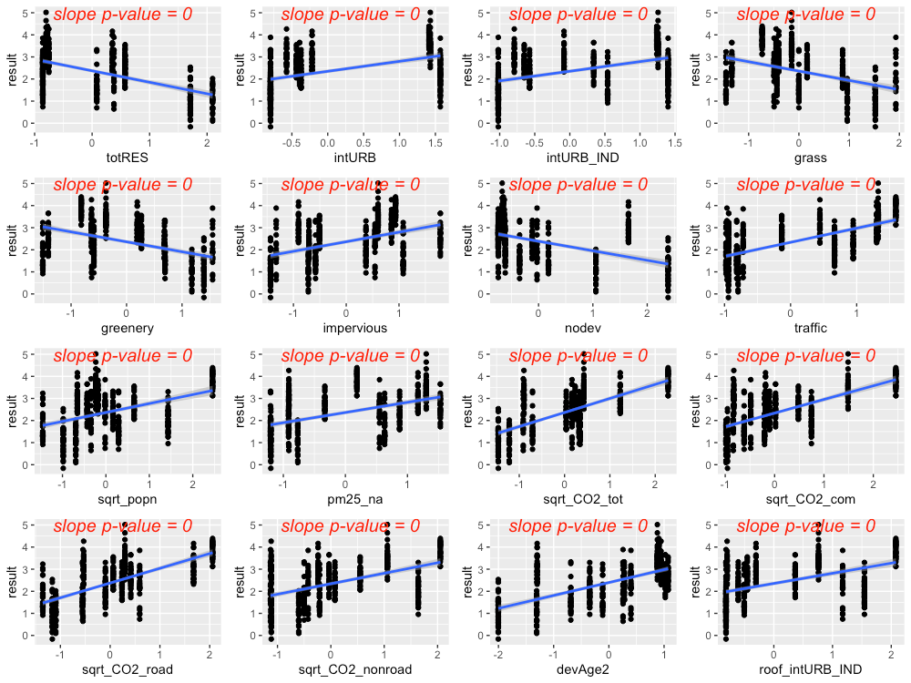

**Figure 4.5** Strong predictors for copper, showing linear model fit (blue
line) for the relationship between ln-transformed copper concentration
and each predictor in turn.

The precipitation predictor used for copper was 21-day cumulative
precipitation. In addition, evidence of higher copper concentrations
during summer led us to add *summer* as a categorical predictor to the
copper model (where *summer* = 1 during July, August, September, and
*summer* = 0 for all other months).

Residuals plotted against fitted values showed signs of slight
heterogeneity (Fig 4.6, left plot). Of the variance structures tested,
the best fit was for a combination of two variance structures, where
residual variation differs by agency *j*, and also by rainfall at each
location *i* and date *k*. Parameters δ1 and δ2
are estimated by the model.

$$

var(ε_{ijk}) = \sigma^2_j  (\delta_1- |rain_{ik}|^{δ^2})^2

$$

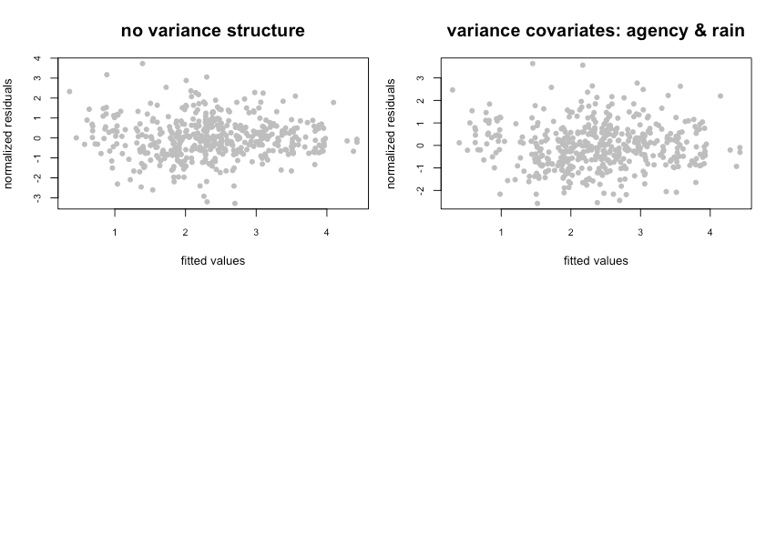

**Figure 4.6**  Normalized residuals from beyond-optimal model, with no
variance structure (left), and with the best fit variance structure
(right).

The best model for copper is a random-intercept model, where the
intercept of the linear model is allowed to shift up or down according
to agency. No signs of temporal or spatial auto-correlation were
detected in auto-correlation plots or variograms.

With the variance structure and random components set, two possible
models emerged to capture the fixed effects:

<!--  ~ rain + summer +traffic +totRES")

 ~ rain + summer + traffic + devAge2 + pm25\_na\ +\ \left(rain\ \times pm25\_na\right)") -->

The first model’s AIC score was lower than that of the second model
(AIC=743.4 vs. 750.5, when models were fitted with ML); however, the
model coefficient for totRES is negative, indicating that increased
residential zoning results in reduced copper concentrations in
stormwater. This relationship makes sense for the 14 watersheds in our
study, but would likely not be appropriate for forested landscapes that
have low residential zoning (thus should have high copper
concentrations). As a result, we selected the second model as the most
suitable for covering the entire area of the stormwater heatmap. Figure
4.7 shows the model fit for each individual predictor, plotted against
data points. Correlation between the three predictors was low (maximum 
correlation = 0.4). Figure 4.8 shows the interaction between rain and pm25\_na,
with higher pm25\_na values in reds and oranges, and lower pm25\_na
values in blues and purples. This interaction shows that, when pm2.5
values are high, increasing amounts of rainfall result in a dilution of
copper in stormwater.

**Figure 4.7** Single-predictor plots for copper, showing fit of the Landscape
Predictor Model to each predictor in turn. Model fitting was performed using 
maximum likelihood (ML) estimation.

**Figure 4.8** Plot showing the interaction between rain and pm25_na that is
present in the best fit model. In areas with high pm25_na values,
increasing amounts of rain result in a dilution of copper in stormwater. 
Model fitting was performed using maximum likelihood (ML) estimation.

Comparisons between the Null Model, Categorical Land Use Model, and
Landscape Predictor Model can be visualized through residuals (Fig. 4.9), 
comparative metrics such as AIC (Table 4.3, and coefficient values 
(Table 4.2; Fig. 4.10). Although the AIC value for the Categorical Land 
Use Model is lower than that of the Landscape Predictor Model, we are not 
confident in the transferability of the Categorical Land Use Model to 
watersheds outside of the 14 in this study. Two of the land use categories 
(Industrial – IND; and Low Density Residential – LDR) each have only two 
watershed representatives in our study. This results in good model fit to 
the data, but not necessarily for all watersheds in Puget Sound area.

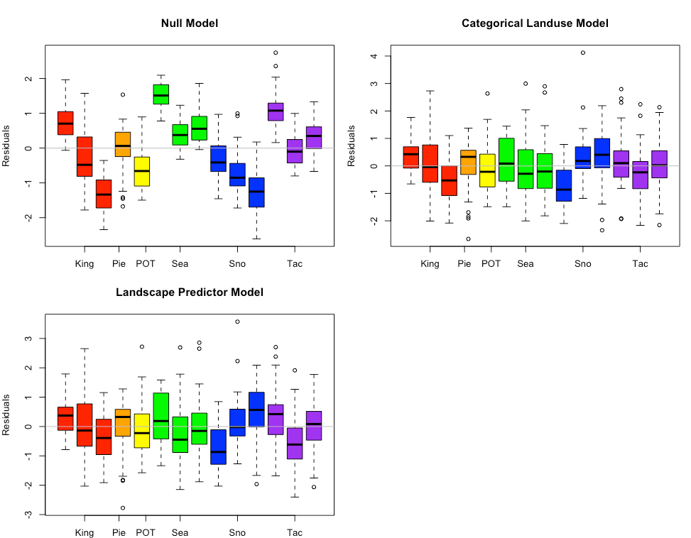

**Figure 4.9** Copper model residuals for the Null Model, Categorical Land Use
Model, and Landscape Predictor Models. Each bar represents one
watershed, with colors representing agencies. Model fitting was performed using 
maximum likelihood (ML) estimation.

**Table 4.3** Coefficient values (standard error in parenthesis) for the three
copper models. For the Categorical Landuse Model, the baseline landuse
is LDR; all other land use categories are adjustments from the baseline.
Final coefficient values for linear mixed effects mdels are based on fitting with 
restricted maximum likelihood (REML) estimation, and may differ slightly from those 
fitted using maximum likelihood (ML) estimation.

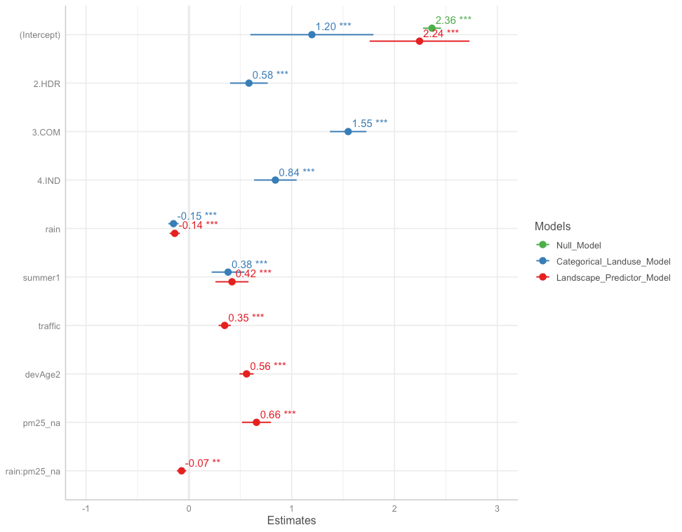

**Figure 4.10** Model coefficients for the Null Model (green), Categorical Land
Use Model (blue), and Landscape Predictor Model (red). Final coefficient values for 
linear mixed effects models are based on fitting with restricted maximum likelihood
(REML) estimation, and may differ slightly from those fitted using maximum likelihood 
(ML) estimation.

The Landscape Predictor Model for total copper, used as the basis for the Stormwater Heatmap total copper layer, is:

*ln*(copper) = 2.24 – 0.14(rain) + 0.42(summer) + 0.35(traffic) + 0.56(devAge2) + 0.66(pm25_na) – 0.07(rain):(pm25_na)

where rain is 21-day cumulative precipitation, and summer is a factor with value = 1 for July, August, September, and value = 0 for all other months.  Note that all predictors (except summer) were first transformed if necessary (e.g. devAge was squared to make devAge2), then standardized prior to use.

### Total Suspended Solids

Based on linear models of *ln*-transformed TSS versus individual
predictors, the strong predictors identified for TSS include: totRES,
traffic, sqrt\_popn, sqrt\_CO2\_res, sqrt\_CO2\_tot, sqrt\_CO2\_com,
sqrt\_CO2\_road, devAge2 (Fig 4.11). Paved was added to the list because
it was a strong predictor for an older version of the model, and paved
areas are associated with elevated TSS in stormwater.

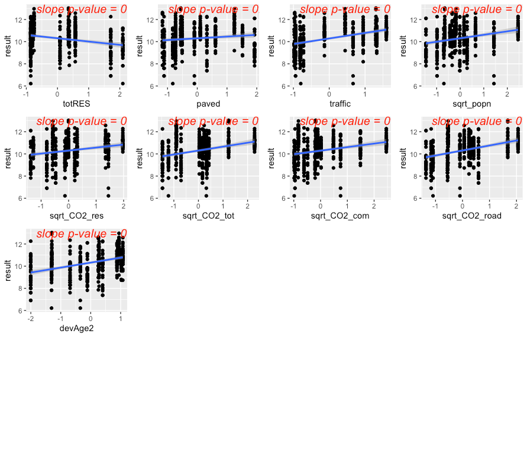

**Figure 4.11** Strong predictors for TSS, showing linear model fit (blue line)
for the relationship between *ln*-transformed TSS concentration and each
predictor in turn. Although it wasn’t as compelling on its own, the
predictor paved was added to the list of strong predictors because it
was a strong predictor in a previous model.

The precipitation predictor used for TSS was 1-day cumulative
precipitation. There was no evidence of seasonal patterns to TSS in
stormwater.

Residuals plotted against fitted values showed signs of slight
heterogeneity (Fig 4.12, left plot). Of the variance structures tested,
the best fit was for a combination of two variance structures, where
residual variation differs by agency *j*, and also by rainfall at each
location *i* and date *k*. The parameters δ is estimated by the model:

$$ 

var(\epsilon{ijk}) = \sigma^2_j(e^{2δrain_{ik}})

$$ 

**Figure 4.12** Normalized residuals from beyond-optimal model, with no
variance structure (left), and with the best fit variance structure
(right).

The best model for TSS is a random-intercept model, where the intercept
of the linear model is allowed to shift up or down according to agency.
No signs of temporal or spatial auto-correlation were detected in
auto-correlation plots or variograms.

With the variance structure and random components set, two possible
models emerged to capture the fixed effects:
$$

\ln{TSS} \sim rain + traffic + paved

$$ 

$$
\ln{TSS} \sim rain + traffic + totRES

$$

The AIC score for these two models was very close, with the first
model’s AIC score slightly lower (AIC=1246.0 vs. 1246.5, when models
were fitted with ML). In the second model, the coefficient for totRES is
negative, indicating that increased residential zoning results in
reduced TSS in stormwater. This relationship makes sense for the 14
watersheds in our study, but would likely not be appropriate for
forested landscapes that have low residential zoning (thus should have
high TSS concentrations). As a result, we selected the first model as
the most suitable for covering the entire area of the stormwater
heatmap. Figure 4.13 shows the model fit for each individual predictor,
plotted against data points. Correlation between the two predictors was 
low (correlation coefficient < 0.1).

**Figure 4.13** Single-predictor plots for TSS, showing fit of the
Landscape Predictor Model to each predictor. Model fitting was performed 
using maximum likelihood (ML) estimation.

Comparisons between the Null Model, Categorical Land Use Model, and
Landscape Predictor Model can be visualized through residuals (Fig.
4.14) comparative metrics such as AIC, and coefficient values (Table 4.4; Fig. 4.15). The lowest AIC
value is for the Landscape Predictor Model, indicating best fit to the
TSS data of these three models.

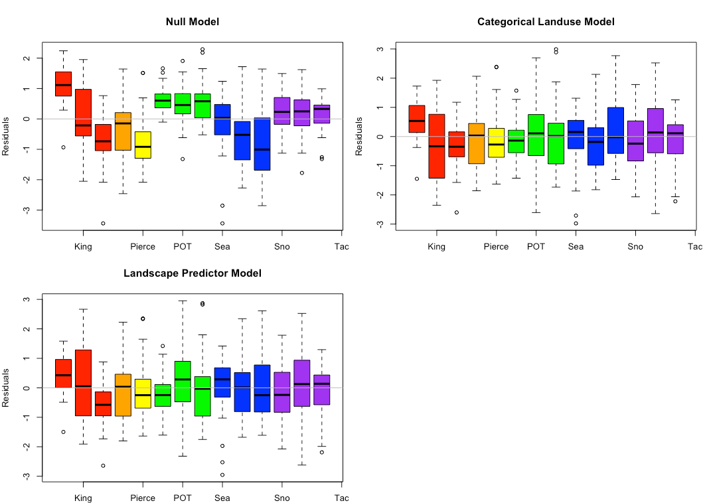

**Figure 4.14** TSS model residuals for the Null Model, Categorical Land Use
Model, and Landscape Predictor Models. Each bar represents one
watershed, with colors representing agencies.

**Table 4.4** Coefficient values (standard error in parenthesis) for the three
TSS models. For the Categorical Landuse Model, the baseline landuse is
LDR; all other land use categories are adjustments from the baseline.
Final coefficient values for linear mixed effects

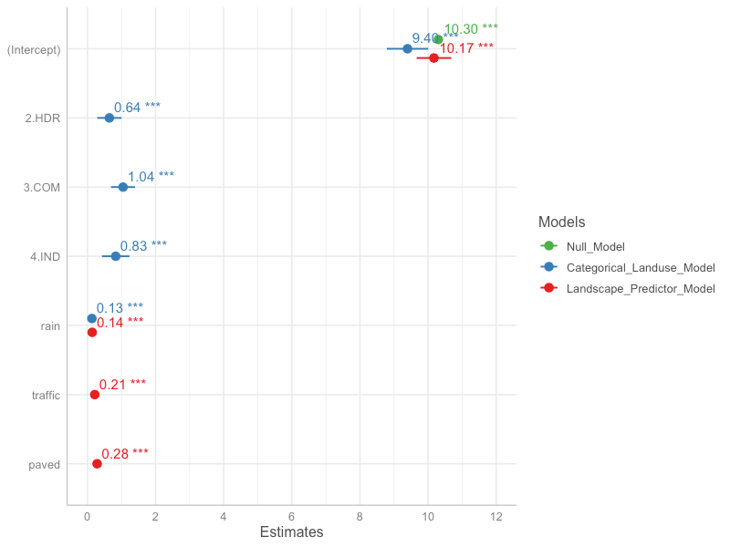

**Figure 4.15** Model coefficients for the Null Model (green), Categorical
Land Use Model (blue), and Landscape Predictor Model (red).Final coefficient 
values for linear mixed effects models are based on fitting with restricted
maximum likelihood (REML) estimation, and may differ slightly from those fitted
using maximum likelihood (ML) estimation.

The final Landscale Predictor Model for TSS, used as the basis of the Stormwater heatmap TSS layer, is:

*ln*(TSS) = 10.17 + 0.14(rain) + 0.21(traffic) + 0.28(paved)

where rain is 1-day cumulative precipitation. Note that all predictors were standardized prior to use.

### Phosphorus

Based on linear models of *ln*-transformed phosphorus versus individual
predictors, the strong predictors identified for phosphorus include:
traffic, sqrt\_popn, sqrt\_slope, sqrt\_CO2\_res, sqrt\_CO2\_tot,
sqrt\_CO2\_road and devAge2 (Fig 4.16). Paved and grass were added to
the list because they were strong predictors for an older version of the
model, and both are associated with elevated phosphorus in stormwater.

**Figure 4.16** Strong predictors for phosphorus, showing linear model fit
(blue line) for the relationship between ln-transformed phosphorus
concentration and each predictor in turn. Although they weren’t
compelling on their own, the predictors grass and paved were added to
the list of strong predictors because they were strong predictor
s in a
previous model.

The precipitation predictor used for phosphorus was 21-day cumulative
precipitation. In addition, evidence of higher phosphorus concentrations
during summer led us to add *summer* as a categorical predictor to the
phosphorus model (where *summer* = 1 during July, August, September, and
*summer* = 0 for all other months).

Residuals plotted against fitted values showed signs of slight
heterogeneity (Fig 4.17, left plot). Of the variance structures tested,
the best fit allows residual variation to differ by agency *j*:

     var(*ε*j) = σ2j

**Figure 4.17**

 Figure 4.17 Normalized residuals from beyond-optimal model, with no
variance structure (left), and with the best fit variance structure
(right).

The best model for phosphorus is a random-intercept model, where the
intercept of the linear model is allowed to shift up or down according
to agency. No signs of temporal or spatial auto-correlation were
detected in auto-correlation plots or variograms.

With the variance structure and random components set, two possible
models emerged to capture the fixed effects:

    *ln*(phosphorous) ~ rain + summer + grass + paved + sqrt_CO2_road 

    *ln*(phosphorous) ~ rain+ summer + grass + paved 

The AIC score for these two models was close, with the first model’s AIC
score lower than that of the second model (AIC=830.3 vs. 839.8, when
models were fitted with ML). As a result, we selected the first model.
Figure 4.18 shows the model fit for each individual predictor, plotted
against data points. Correlation between grass and paved was relatively high
(-0.8), while the other correlation coefficients were lower (-0.4, -0.1). 
While this model fit the 14 waterssheds in our study, the high negative 
correlation betweeen paved and grass indicates the need for caution with this
model. There is good evidence to support a positive relationship between 
phosphorous concentration and both residential lawns (fertilizer) and paved
roadways.  For example, Waschbusch et al. (1999) found that lawns and roads
contributed ~80% of total and dissolved phosphorous loading. Land use affects
the contribution from different sources, with lawns and leaf litter being more
important in residential areas and roads being more important in commercial
and industrial areas. 

**Figure 4.18** Single-predictor plots for phosphorus, showing fit of the
Landscape Predictor Model to each predictor. Model fitting was performed 
using maximum likelihood (ML) estimation.

Comparisons between the Null Model, Categorical Land Use Model, and
Landscape Predictor Model can be visualized through residuals (Fig.
4.19), comparative metrics such as AIC (Table 4.5), and coefficient
values (Table 4.5; Fig. 4.20). The lowest AIC value is for the Landscape 
Predictor Model, indicating best fit to the phosphorus data of these three models.

**Figure 4.19** Phosphorus model residuals for the Null Model, Categorical
Land Use Model, and Landscape Predictor Models. Each bar represents one
watershed, with colors representing agencies. Model fitting was performed
using maximum likelihood (ML) estimation.

**Table 4.5** Coefficient values (standard error in parenthesis) for the three
phosphorus models. For the Categorical Landuse Model, the baseline
landuse is LDR; all other land use categories are adjustments from the
baseline. Final coefficient values for linear mixed effects models are
based on fitting with restricted maximum likelihood (REML) estimation, and 
may differ slightly from those fitted using maximum likelihood (ML) estimation.

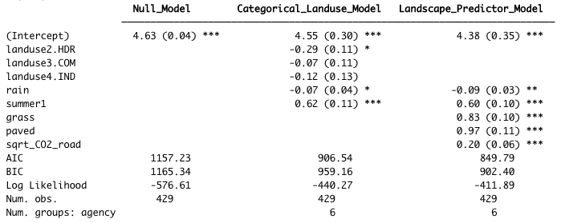

**Figure 4.20** Model coefficients for the Null Model (green), Categorical Land Use Model (blue), and Landscape Predictor Model (red). 
Final coefficient values for linear mixed effects models are based on fitting with restricted maximum likelihood (REML) estimation,
and may differ slightly from those fitted using maximum likelihood (ML) estimation.

The Landscape Predictor Model for phosphorous, used as the basis for the Stormwater Heatmap phosphorous layer, is:
 
*ln*(phosphorous) = 4.38- 0.09(rain) + 0.60(summer) +0.83(grass) + 0.97(paved) + 0.2(sqrt_CO2_road)

where rain is 21-day cumulative precipitation, and summer is a  factor with value = 1 for July, August, and September, 
and value = 0 for all other months. Note that all predictors (except summer) were first transformed if necessary
(the square root was taken of CO2_road to generate sqrt_CO2_road), then standardized prior to use.  

### Total Zinc
Based on linear models of ln-transformed total zinc versus individual predictors, 
the strong predictors identified for total zinc include: totRES, intURB_IND, grass, 
greenery, paved, impervious, trees, traffic, pm25_na, sqrt_CO2_tot, sqrt_CO2_com, 
sqrt_CO2_nonroad, roof_intURB_IND (Fig 4.21).  

**Figure 4.21** Strong predictors for total zinc, showing linear model fit (blue line) for the 
relationsihp between *ln*-transformed total zince concentration and each predictor in turn.

The precipitation predictor used for total zinc was 14-day cumulative precipitation. In addition, 
evidence of higher total zinc concentrations during summer led us to add *summer* as a categorical
predictor to the total zinc model (where *summer* = 1 during July, August, and September, and 
*summer*= 0 for all other months).

Residuals plotted against fitted values showed a pattern, indicating a chance of slight heteroskedasticity
(Fig. 4.22, left plot). Of the variance structures tested, the best fit allows residual variation to 
differ by agency *j*. 

var(εj) = σ2j

**Figure 4.22** Normalized residuals from beyond-optimal model, with no variance structure (left), and with the best
fit variance structure (right). 

The best model for total zinc is a random-intercept model, where the intercept of the linear model is allowed to shift 
up or down according to agency.  No signs of temporal or spatial auto-correlation were detected in auto-correlation plots
or variograms. 

With the variance structure and random components set, three possible models emerged to capture the fixed effects:

*ln*(total zinc) ~ rain + summer + traffic + pm25_na + paved + rain:pm25_na
*ln*(total zinc) ~ rain + summer + traffic + pm25_na + greenery + rain:pm25_na
*ln*(total zinc) ~ rain + summer + trees + pm25_na + intURB_IND + rain:pm25_na + rain:intURB_IND

The AIC score for these three models was close, with the first model’s AIC score lower than that of the second 
or third models (AIC=782.8 vs. 785.8 and 792.1, when models were fitted with ML).  As a result, we selected the 
first model.  Figure 4.23 shows the model fit for each individual predictor, plotted against data points. 
Correlation between the three predictors was low (maximum correlation coefficient = 0.5).  Figure 4.24 shows
the interaction between rain and pm25_na, with higher pm25_na values in reds and oranges, and lower 
pm25_na values in blues and purples.  This interaction shows that, when pm2.5 values are high, increasing 
amounts of rainfall result in a dilution of zinc in stormwater. 

**Figure 4.23** Single-predictor plots for total zinc, showing fit of the Landscape Predictor Model to each predictor. 
Model fitting was performed using maximum likelihood (ML) estimation. 

**Figure 4.24**  Plot showing the interaction between rain and pm25_na that is present in the best fit model. 
In areas with high pm25_na values, increasing amounts of rain result in a dilution of copper in stormwater. 
Model fitting was performed using maximum likelihood (ML) estimation.

Comparisons between the Null Model, Categorical Land Use Model, and Landscape Predictor Model can be visualized through residuals (Fig. 4.25) 
and also coefficient values (Table 4.46; Fig. 4.26).  The lowest AIC value is for the Landscape Predictor Model, indicating best fit to the
total zinc data of these three models.

**Figure 4.25**  Total zinc model residuals for the Null Model, Categorical Land Use Model, and Landscape Predictor Models. 
Each bar represents one watershed, with colors representing agencies.  Model fitting was performed using maximum likelihood (ML) estimation.

**Table 4.6**  Coefficient values (standard error in parenthesis) for the three total zinc models.  For the 
Categorical Landuse Model, the baseline landuse is LDR; all other land use categories are adjustments from 
the baseline.  Final coefficient values for linear mixed effects models are based on fitting with REML, and 
may differ slightly from coefficient values based on fitting with ML.

**Figure 4.26** Model coefficients for the Null Model (green), Categorical Land Use Model (blue), and Landscape 
Predictor Model (red).  Final coefficient values for linear mixed effects models are based on fitting with REML, 
and may differ slightly from coefficient values based on fitting with ML.

The landscape predictor model for total zinc, used as the basis for the Stormwater Heat Map total zinc layer, is:

*ln*(total zinc) = 4.09 – 0.12(rain) + 0.43(summer) + 0.29(traffic) + 0.33(pm25_na) + 0.55(paved) – 0.10(rain*pm25_na)

where rain is 14-day cumulative precipitation, and summer is a factor with value=1 for July, August, September, and 
value=0 for all other months.  Note that all predictors (except summer) were standardized prior to use. 

### Total Kjeldahl Nitrogen
Out of 420 Total Kjeldahl nitrogen (TKN) samples, 41 samples (9.8%) were flagged as non-detects, with a variety of detection
limits ranging from 30 to 500.  The majority of non-detect samples came from three agencies: Pierce County, Port of Tacoma, 
and Snohomish County (Fig. 4.27).  High detection limits in Pierce County and Port of Tacoma strongly truncated the lower half 
of these data sets. 
  

**Figure 4.27**  Concentrations of total Kjeldahl nitrogen in samples collected by agency.  Red dots indicate detected values,
while blue dots indicate the detection limit for samples flagged as non-detect. 

Based on linear models of *ln*-transformed TKN versus individual predictors, the strong predictors identified for TKN include: 
roofs, nodev, traffic, sqrt_popn, sqrt_CO2_res, sqrt_CO2_tot, sqrt_CO2_road, devAge2, roof_inURB and roof_intURB_IND (Fig. 4.28).  

**Figure 4.28** Strong predictors for total Kjeldahl nitrogen (TKN), showing linear model fit (blue line) for the relationship between
*ln*-transformed TKN concentration and each predictor in turn.

The precipitation predictor used for TKN was 14-day cumulative precipitation.  In addition, evidence of higher TKN concentrations 
during summer led us to add summer as a categorical predictor to the TKN model (where summer = 1 during July, August, September,
and summer = 0 for all other months).  

Residuals plotted against fitted values showed signs of slight heterogeneity (Fig. 4.29, left plot).  Of the variance structures tested,
the best fit allows residual variation to differ by agency j.  

var(εj) = σ2j

**Figure 4.29** Normalized residuals from beyond-optimal model, with no variance structure (left), and with the best fit variance structure (right).

The best model for TKN is a random-intercept model, where the intercept of the linear model is allowed to shift up or down according to agency.  
No signs of temporal or spatial auto-correlation were detected in auto-correlation plots or variograms.
With the variance structure and random components set, three possible models emerged to capture the fixed effects:

*ln*(TKN) ~ rain + summer + traffic + devAge2

*ln*(TKN) ~ rain + summer + traffic + nodev

*ln*(TKN) ~ rain + summer + sqrt_CO2_road + devAge2

Each of these models captures two major contributors to total nitrogen: vehicles and amount/age of development. 
The AIC scores for all three models were close, with the models ordered from lowest to highest AIC score (903.4,
911.6, 912.2, when models were fitted using ML).  

We selected the third model, with predictors sqrt_CO2_road + devAge2.  While all models fit the data reasonably well,
we opted to use the slightly coarser-scale predictor sqrt_CO2_road rather than traffic.  The amount of traffic on
Puget Sound freeways exceeds the traffic in our dataset by an order of magnitude, and the TKN vs. traffic relationship
may lose its linear shape at high traffic levels.  In contrast, the CO2_road values in our dataset range from about 150 
to 7900, while the range of pixel values for the entire Puget Sound region is 0 to 12,700.  Less than 0.3% of pixels
exceed 7900.  This lends greater confidence to the TKN model with sqrt_CO2_road as a predictor. Figure 4.30 shows the
model fit for each individual predictor, plotted against data points.  Correlation between the two predictors was low 
(correlation coefficient = 0.4).

**Figure 4.30** Single-predictor plots for total Kjeldahl nitrogen, showing fit of the Landscape Predictor Model 
to each predictor.  Model fitting was performed using maximum likelihood (ML) estimation.

Comparisons between the Null Model, Categorical Land Use Model, and Landscape Predictor Model can be visualized through residuals (Fig. 4.31), 
comparative metrics such as AIC (Table 4.7), and coefficient values (Table 4.7; Fig. 4.32).  Although the AIC value for the Categorical Land 
Use Model is lower than that of the Landscape Predictor Model, we are not confident in the transferability of the Categorical Land Use Model 
to watersheds outside of the 14 in this study.  Two of the land use categories (Industrial – IND; and Low Density Residential – LDR) each have 
only two watershed representatives in our study.  This results in good model fit to the data, but not necessarily for all watersheds in Puget Sound area.

**Figure 4.31** Total Kjeldahl nitrogen model residuals for the Null Model, Categorical Land Use Model, and Landscape Predictor Models. 
Each bar represents one watershed, with colors representing agencies.  Model fitting was performed using maximum likelihood (ML) estimation.

**Table 4.7** Coefficient values (standard error in parenthesis) for the three total Kjeldahl nitrogen models.  For the Categorical Landuse Model, 
the baseline landuse is LDR; all other land use categories are adjustments from the baseline.  Final coefficient values for linear mixed effects 
models are based on fitting with restricted maximum likelihood (REML) estimation, and may differ slightly from those fitted using maximum likelihood (ML) estimation.

**Figure 4.32** Model coefficients for the Null Model (green), Categorical Land Use Model (blue), and Landscape Predictor Model (red). 
Final coefficient values for linear mixed effects models are based on fitting with restricted maximum likelihood (REML) estimation, 
and may differ slightly from those fitted using maximum likelihood (ML) estimation.

Censored data made up 9.7% of the TKN sample results.  Although the EPA allows substitution of (0.5 x detection limit) for censored values 
when < 15% of samples are non-detect (USEPA, 2009), we wanted to verify that substitution did not have a large effect on the parameter values
for our dataset.  Censored methods have not yet been developed for mixed effects models; as a result, we performed the (0.5 x detection limit)
substitution for the TKN data, and fit a simple linear model using the predictors: 14-day rainfall, summer, sqrt_CO2_road and devAge2.  We 
compared the parameter values to a censored data model using the NADA package in R (Lee, 2020), and found that the two models had very similar 
parameter values (Table 4.8).  This confirmed that the TKN data with (0.5 x detection limit) substitution could be used to generate valid models 
using mixed effects techniques.

**Table 4.8** Comparison of parameter values generated by simplified lienar models with and without methods to account for censored values. 
|                   | non-detects substituted for 0.5 x detection limit  | censored model |
|-------------------|-----------------|----------------|
|(intercept)        |6.57 (0.04)      |6.60 (0.04)     |
|rain (14-day std   |-0.16 (0.04)     |-0.16 (0.04     |
|summer             |0.67 (0.14)      |0.65 (0.13)     |
|sqrt CO2 road      |0.25 (0.04)      |0.24 (0.04)     |
|devAge2            |0.22 (0.04)      |0.21 (0.04)     |

The Landscape Predictor Model for TKN, used as the basis for the Stormwater Heat Map TKN layer, is:

*ln*(TKN) = 6.52 – 0.15(rain) + 0.60(summer) + 0.28(sqrt_CO2_road) + 0.22(devAge2)

where rain is 14-day cumulative precipitation, and summer is a factor with value=1 for July, August, September, 
and value=0 for all other months.  Note that all predictors (except summer) were first transformed if necessary 
(the square root was taken of CO2_road to generate sqrt_CO2_road; devAge was squared to generate devAge2), then 
standardized prior to use. 

## Translating Equations to the Stormwater Heatmap

The process of translating statistical equations for chemical contaminants to the Stormwater heatmap involved manipulation of the grid and equations.  

### Convolving the Base Map
The first step of translating COC equations to the Stormwater Heatmap was to convolve each grid on the base map.  Following convolution of the map, regression equations were applied to each grid box to predict the concentration of contaminants expected for that grid box.  

For COCs with traffic as a predictor (copper, TSS, zinc), the maximum traffic level in the grid map was clamped to 31,000 AADT.  This upper limit corresponds to the maximum level of traffic found in the watersheds that provided data used for generating statistical equations.  On freeways, which were not analyzed in this study, traffic conventrations can reach 240,000 AADT. By clamping traffic, we avoid extrapolating beyond the range of our data.  This is a conservative approach because landscape predictors may not behave in a linear fashion at values beyond our range. Indeed, when the traffic level is clamped at 31,000 AADT for TSS, predicted TSS values on freeways are in the same range as those found on freeways across the country (data from USGS Highway Runoff Database).  This suggests that, for some COCs, traffic may be a linear predictor over the values found in our data, but may reach an asymptote at higher values. 

### Applying Mixed Effects Equations to the Stormwater Heatmap
Utilizing a mixed effects model structure, along with a variance structure to account for heteroskedasticity, allowed us to obtain the best parameter values for each COC.  The difference in parameter values generated by equations with and without random effects and/or variance structure illustrates how parameter values change according to the equation structure.  For example, for total Kjeldahl nitrogen (TKN), regression values for each parameter can be compared for four models: 1) full model with random effects and variance structure, 2) random effects only (no variance structure), 3) variance structure only (no random effects), and 4) no random effects and no variance structure (Table 4.9).  By specifying the correct random effects (i.e. random effects by agency) and variance structure (i.e. variance co-variate = agency) for TKN, we find the most appropriate fit to the data for the relationship between this COC and the suite of predictors. 

With respect to translating mixed effects model equations to the Stormwater Heatmap to generate predictions for each grid box, the model becomes simplified. This is because we are interested in predicted COC values for the entire Puget Sound region, rather than the COC values that would be generated by the collection timing, analysis protocol, or biases of a specific agency. As such, we can largely ignore the agency-specific intercepts.  We thus utilize the fitted value of the intercept for *all* watersheds and agencies in the Stormwater Heatmap, and do not adjust the intercept up or down according to agency. This allows us to predict COC values for the entire Puget Sound model domain, which is comprehensive of watersheds *outside* the agency boundaries for which we have monitoring data.

When it comes applying the variance structure to the full model domain of the heatmap, these effects have already been incorporated into the best fit model (Table 4.8). We accounted for the mild heteroskedasticity evident in COCs by specifying the variance structure to properly weigh the impact of each data point on the best fit model. No further extension of the variable structure is necessary for generating model predictions on the Stormwater Heatmap. 

**Table 4.9** Parameter values for four models of total Kjeldahl nitorgen: 1) full model with random effects and variance structure; 2)random effects only (no variance structure); 3) variance structure only (no random effects); 4) no random effects, no variance structure.  Models are for illustrative purposes only, to show the effect of variance stucture and random effects on parameter values for predictor variables. 

|                   | **Full Model**  | **Random effects only**  |**Variance structure only**  |**No random effects, no variance structure**|
|-------------------------------------|--------------------------|-----------------------------|--------------------------------------------|
|intercept          | 6.523           |6.521                     |6.642                        |6.574                                       |
|rain               |-0.149           |-0.157                    |-0.148                       |-0.156                                      |
|summer             |0.603            |0.675                     |0.606                        |0.667                                       |
|sqrt CO2 road      |0.276            |0.276                     |0.277                        |0.253                                       |
|devAge2            |0.220            |0.240                     |0.203                        |0.218                                       | 

**Citation:**

Faraway, Julian J, 2006. Extending the Linear Model with R: Generalized 
Linear, Mixed Effects and Nonparametric Regression Models.  Boca Raton 
(FL): Chapman & Hall/CRC

Hobbs, W., B. Lubliner, N. Kale, and E. Newell, 2015. Western Washington 
NPDES Phase 1 Stormwater Permit: Final Data Characterization 2009-2013.
Washington State Department of Ecology, Olympia, WA. Publication No. 
15-03-001. Available online at:
https://fortress.wa.gov/ecy/publications/SummaryPages/1503001.html 

Lee, Lopaka, 2020. NADA: Nondetects and Data Analysis for Environmental Data.
R package version 1.6-1.1. Available online at: https://CRAN.R-project.org/package=NADA

Pinheiro J, Bates D, DebRoy S, Sarkar D, R Core Team, 2021. nlme: Linear 
and Nonlinear Mixed Effects Models. R package version 3.1-152. 
Available online at: https://CRAN.R-project.org/package=nlme 

R Core Team, 2021. R: A language and environment for statistical computing.
R Foundation for Statistical Computing, Vienna, Austria. 
Available online at: https://www.R-project.org/

U.S. Environmental Protection Agency, 2009, Statistical analysis of
groundwater monitoring data at RCRA facilities, Unified guidance, 
EPA 530-R-09-007.  

USGS Highway Runoff DataBase.  Website visited 11/01/2021. 
https://www.usgs.gov/software/hrdb-highway-runoff-database-software-page

Waschbusch, R.J., W.R. Selbig, and R.T. Bannerman, 1999. Sources of Phosphorus 
in Stormwater and Street Dirt from Two Urban Residential Basins In Madison, 
Wisconsin, 1994–95. U.S. Geological Survey Water-Resources Investigations 
Report 99–4021.

Zuur AF, Ieno EN, Walker NJ, Saveliev AA, Smith GM. 2009. Mixed Effects
Models and Extensions in Ecology with R. New York (NY): Springer

\[1\] Phase I Permittees include: cities of Tacoma and Seattle; King,
Snohomish, Pierce and Clark counties; Ports of Tacoma and Seattle. For
this study, all data were used with the exception of those from Clark
County (outside of the Puget Sound region), Port of Seattle (too
different from all other Puget Sound watersheds), and Pierce County High and Low Density Residential (outfall data was collected in a stream rather than at an outfall).

\[2\] See:
<a href="<<https://www.commerce.wa.gov/serving-communities/growth-management/puget-sound-mapping-project>/" class="uri"><del>https://www.commerce.wa.gov/serving-communities/growth-management/puget-sound-mapping-project</del></a>

 USGS Highway Runoff DataBase.  Website visited 11/01/2021. <https://www.usgs.gov/software/hrdb-highway-runoff-database-software-page>  
